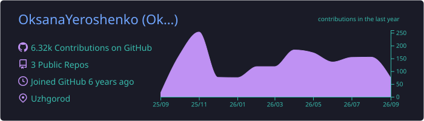

<!-- ============ HEADER ============ -->

  

<h1 align="center">Oksana Yeroshenko</h1>
<h3 align="center">Odoo Developer &nbsp;|&nbsp; Uzhhorod, Ukraine</h3>

  
  
  

  
  
  
  

---

### About me

Odoo developer based in Uzhhorod, Ukraine. I build and customize ERP systems that
companies actually run their business on — from the first custom module to a live
production rollout.

- Custom Odoo modules and version-to-version migrations
- Payment gateways and third-party API integrations
- Accounting, sales, inventory and warehouse business logic
- PostgreSQL data models, OWL / QWeb on the front end
- Day-to-day work across several client ERP projects

**Open for freelance and long-term projects.**
Reach me at [odoo-pro.com.ua](https://odoo-pro.com.ua/) or on
[LinkedIn](https://www.linkedin.com/in/oksana-yeroshenko-276929253).

---

### Tech stack

  
  
  
  
  

  
  
  
  
  
  

---

### GitHub activity

  

<!--
  OPTIONAL EXTRA WIDGETS
  ----------------------
  The two most popular cards (github-readme-stats and github-profile-trophy) run on
  public Vercel deployments that are paused as of August 2026, so they render as an
  error box. Two options:

  1) Wait — the public instances usually come back after a while, then uncomment:

  
  
  

  2) Better: deploy your own copy — fork github.com/anuraghazra/github-readme-stats,
     import it into vercel.com, add a PAT as the PAT_1 env variable, and replace the
     host with your own <project>.vercel.app. Your own instance never gets paused and
     with the token it can also count private-repo contributions.

  Streak counter (works, but the public instance hits GitHub rate limits at times):
  

  Note: capsule-render and readme-typing-svg only draw their text when the SVG is
  opened directly - inside a GitHub  the text stays invisible, which is why the
  title here is plain markdown instead of a picture.

  Profile view counter:
  
-->

---

  <i>Have an Odoo project in mind? Let's talk.</i>

  

